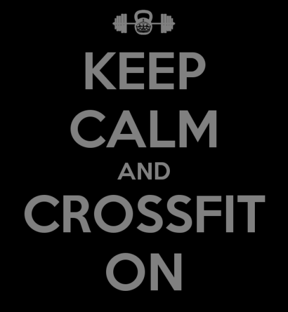

A Year of Crossfit
==================

This post was going to be about my experience participating in the [Crossfit Games][games], but I thought it would be timely, given my impending departure from Boston, to instead share my thoughts on Crossfit overall. I'll be reluctantly leaving [Crossfit Boston][CFB] in a few weeks after about 14 months as a member, and in this post I'll share my thoughts on the Crossfit community and fitness program. **Note:** These are only my opinions and only reflect my experience at Crossfit Boston and a few other boxes around the country.

Crossfit Community
------------------

The best part of Crossfit for me is, hands down, the community aspect. The Crossfit Boston (CFB) community is always encouraging and has been very motivating. You can feel the community in everything from the group structure of the classes to the fact that every gym posts their WOD online for the public every day.

The biggest motivating factor for me in sticking with Crossfit was the group classes. I lifted everyday in high school but lost all drive in college. The difference? I was on the football team in high school and the camaraderie kept me in the weight room. I derive a similar feeling from the Crossfit group classes. Even though everyone was at a different stage in their training, everyone encourages each other and it creates a great atmosphere. Add onto that partner workouts that encourage cheering each other on and you have a great recipe for members to really care about their workouts and their peers'. It's what separates Crossfit from the regular "globo gyms" and even from group classes at other places.

The community extends beyond each box, as well. Crossfit gyms are known for being open to traveling members, either for free or for a small visit fee. The gym near my spring break this year [(Real Fitness Sarasota)][RFS] just asked that we consider buying a (very comfy) T-shirt when we visited. The coaches at the gyms I visited have always been friendly and the members welcoming. It's been great to have a familiar workout when I'm away from home.

I've seen some [places][gawker] refer to Crossfit gyms as purely masculine affairs, staffed by bro-ish assholes who are even more vain than your standard gym rat. In my personal experience, this couldn't be less true. First, the membership I've seen in gyms across the country has really covered run the whole spectrum of fitness abilities. I've worked out with both 65 year-old grandmothers and 24 year-old business school students. They've all impressed me with both their intensity and their friendliness. Second, all the coaches I've met have been friendly and gently encouraging. They welcomed new members, even those who didn't fit the MMA-shorts, minimalist shoe, Crossfit t-shirt aesthetic. They cared about their members' progress and none of them were douchebags.

Workouts
--------

Of course, if all I wanted was a community, I could have found other, cheaper groups to join! I walked into CFB the first time, and quickly came to love, the workouts. In the last year, I've lost around 20 pounds and at least 4 inches off my waist. I'm more flexible than I've ever been and can finally do 5 pull-ups (for the first time ever).

Those are just the more easily quantified results, too. I've looked at this year of Crossfit membership as an investment in my future fitness. I will probably not always be a member at a Crossfit box, but the movements and techniques I learned at CFB are applicable in any gym. My repertoire of fitness activities is so much bigger now and I feel equipped to keep myself fit on my own. I think this is really powerful.

The workouts are a mix of strength training, body weight/gymnastics movements, and short-distance cardio activities. Each WOD is an hour long, including the warmup and skill sessions, and is usually capped off by a 5-20 minute high intensity "metcon". The programming at CFB has been really helpful for me in discovering my weak points. I've been able to explore movements that I wouldn't have considered on my own and learn techniques for scaling movements so that I can improve on my weaknesses.

CFB offers an Olympic lifting class on Wednesday nights that has been a particular high point for me. I've attended as many weeks as I could and have seen my numbers climb by leaps and bounds. I figured I could clean because I had done it during high school; boy, was I wrong. I now clean better, snatch better and even squat better. I've got good enough form to keep doing these movements for decades, too, without throwing out my back or destroying my knees.

Conclusion
----------

I've loved my year at Crossfit Boston. I could hardly recommend it more highly to anyone of any level looking for a general fitness program. I think people of all ages can benefit from the community and the intensity that Crossfit brings, not to mention the fitness! Even if I don't join a gym immediately after my move to DC, I'll have the experience I gained at CFB to guide my fitness in the future.

[games]: http://games.crossfit.com "Crossfit Games"
[CFB]: http://crossfitboston.com/ "Crossfit Boston Homepage"
[RFS]: http://realfitnesssarasota.com/ "Real Fitness Sarasota Homepage"
[gawker]: https://gawker.com/5925537/crossfit-bros-are-a-new-more-dangerous-form-of-bro
